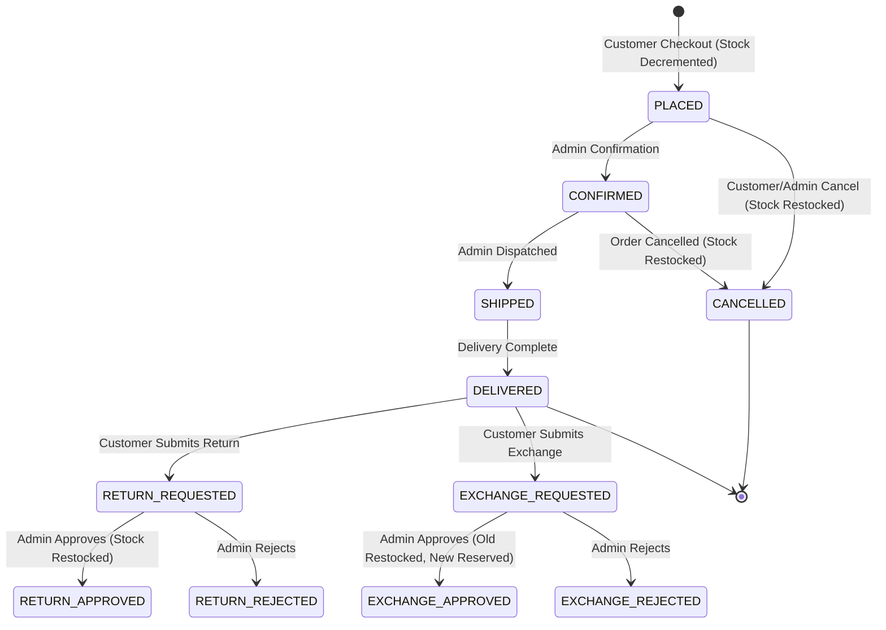
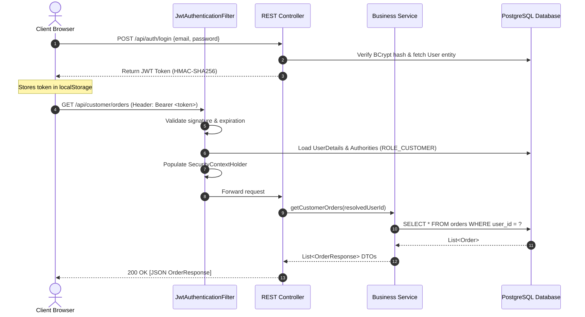

# 🏛️ Mini-DMart — Architectural Design Document

This document outlines the architectural blueprints, design patterns, transaction boundaries, and state machines implemented in the Mini-DMart system.

---

## 1. High-Level Architectural Pattern

Mini-DMart is structured around the **Layered Architectural Pattern** (N-Tier Architecture), ensuring loose coupling, separation of concerns, and maintainability:

```
┌─────────────────────────────────────────────────────────────┐
│                    Presentation Layer                       │
│    (Responsive HTML5, Modular CSS3, Vanilla JS Fetch API)   │
└──────────────────────────────┬──────────────────────────────┘
                               │ JSON over HTTP
                               ▼
┌─────────────────────────────────────────────────────────────┐
│                   Security & Filter Layer                   │
│   (JwtAuthenticationFilter, SecurityContextHolder, RBAC)    │
└──────────────────────────────┬──────────────────────────────┘
                               │ Authenticated Principal
                               ▼
┌─────────────────────────────────────────────────────────────┐
│                   REST Controller Layer                     │
│  (Validates payloads, resolves User Principal, returns DTO) │
└──────────────────────────────┬──────────────────────────────┘
                               │ DTO / Command Parameters
                               ▼
┌─────────────────────────────────────────────────────────────┐
│                   Business Service Layer                    │
│   (@Transactional business logic, stock rules, audit trail) │
└──────────────────────────────┬──────────────────────────────┘
                               │ Domain Entities
                               ▼
┌─────────────────────────────────────────────────────────────┐
│                  Data Persistence Layer                     │
│         (Spring Data JPA Repositories & Hibernate)          │
└──────────────────────────────┬──────────────────────────────┘
                               │ SQL via HikariCP Pool
                               ▼
┌─────────────────────────────────────────────────────────────┐
│                 PostgreSQL Relational DB                    │
│        (ACID storage: users, products, orders, etc.)        │
└─────────────────────────────────────────────────────────────┘
```

---

## 2. Order & Stock State Machine

Order lifecycle transitions and stock adjustments are strictly coordinated:



---

## 3. Transaction Management & ACID Guarantees

All state-changing operations are wrapped with `@Transactional` to prevent partial updates and data anomalies:

1. **Checkout (`OrderService.placeOrder`)**:
   - Validates that cart is non-empty.
   - For each item: checks `stockQuantity >= cartQuantity`.
   - Atomically decrements `stockQuantity`.
   - Computes server-side price subtotal (ignoring client prices).
   - Saves `Order` and `OrderItem` records.
   - Clears customer `CartItem` list.
   - Creates `AuditLog` entry.
   - *If any step fails, the entire transaction rolls back, leaving stock and cart untouched.*

2. **Order Cancellation (`OrderService.cancelOrder`)**:
   - Ensures order is in `PLACED` or `CONFIRMED` state.
   - Restores item quantities back to `Product.stockQuantity`.
   - Sets order status to `CANCELLED`.
   - Creates `AuditLog` entry.

3. **Exchange Approval (`ExchangeService.approveExchange`)**:
   - Checks replacement product stock (`newProduct.stockQuantity >= 1`).
   - Decrements replacement product stock (`newProduct.stockQuantity - 1`).
   - Increments original product stock (`oldProduct.stockQuantity + 1`).
   - Updates exchange request status to `APPROVED`.
   - Logs administrative action in `AuditLog`.

---

## 4. Security & Authentication Flow



---

## 5. Centralized Error Handling

All runtime exceptions are captured by [`GlobalExceptionHandler`](file:///C:/Users/Darshana/Downloads/minidmart/minidmart/src/main/java/com/miniproject/minidmart/exception/GlobalExceptionHandler.java):

| Exception | HTTP Status Code | Scenario |
| :--- | :--- | :--- |
| `ResourceNotFoundException` | `404 NOT FOUND` | Requested product, order, or category does not exist |
| `InsufficientStockException` | `400 BAD REQUEST` | Requested checkout quantity exceeds available store stock |
| `BadRequestException` | `400 BAD REQUEST` | Invalid state transition (e.g. cancelling a delivered order) |
| `UnauthorizedException` | `403 FORBIDDEN` | Accessing another customer's order or resource |
| `MethodArgumentNotValidException` | `400 BAD REQUEST` | Jakarta validation failures (`@NotBlank`, `@Min`, `@Email`) |
| `Exception` (Fallback) | `500 INTERNAL ERROR`| Unhandled system errors (logged securely on server) |
